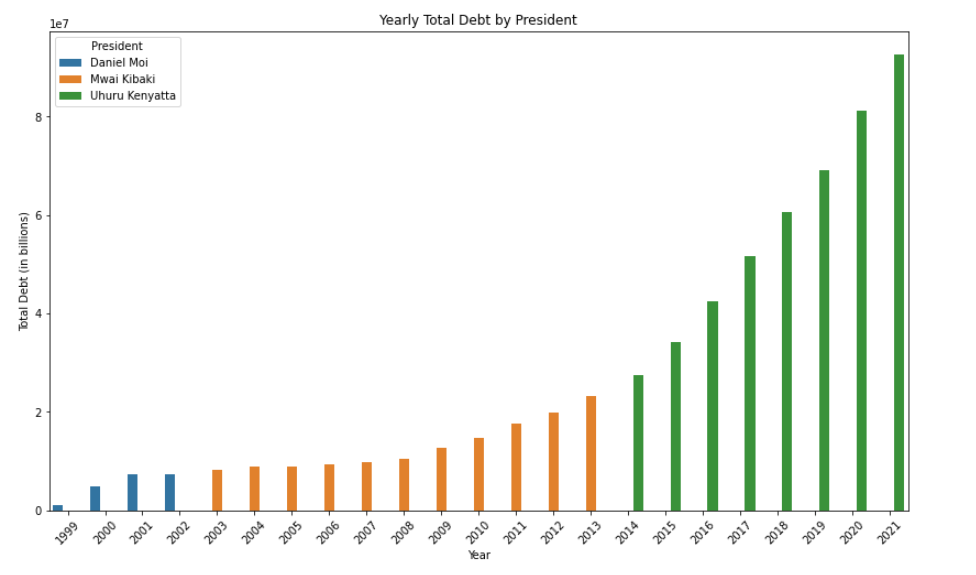
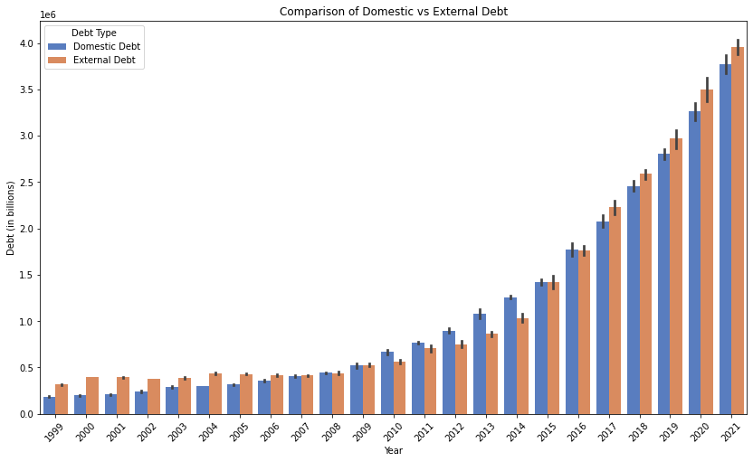

# Kenya Financial Debts Analysis


This project contains two Jupyter Notebooks analyzing Kenya's financial debts. The notebooks include data visualization and analysis on the country's debt situation over different time periods.


## Data Summary

The data comes from the Central Bank of Kenya, but unfortunately we only got data from 1999-2021. The data includes fields like:

- **Year:** The year the debt was recorded.
- **Month:** The month the debt was recorded.
- **Domestic Debt:** Debt owed to local creditors.
- **External Debt:** Debt owed to foreign creditors.
- **Total Debt:** Sum of domestic and external debt.


## Getting Started

To get started with the analysis, you can open the provided Jupyter Notebooks using Jupyter Notebook or JupyterLab. Follow these steps:

1. Clone the repository to your local machine.
2. Navigate to the project directory.
3. Open the Jupyter Notebooks using your preferred environment.

## Prerequisites

Ensure you have the following packages installed to run the notebooks:

- pandas
- matplotlib
- seaborn
- numpy

You can install the required packages using the following command:

```bash
pip install pandas matplotlib seaborn numpy
```


## Data Analysis
### Understanding Kenya's Debt

Kenya has seen changes in its national debt over the years. Knowing these trends helps everyone make better decisions about the economy. This analysis covers data from 1999 to 2021, showing how debt has changed during different presidents' terms.


### Public Debt As per President

The analysis shows significant increases in both domestic and external debt over the years. Different presidents had different impacts on debt levels:

- **Daniel Moi:** Debt levels were relatively stable.
- **Mwai Kibaki:** Debt started to grow, especially towards the end of his term.
- **Uhuru Kenyatta:** There was a sharp increase in debt.





### Additional Key Findings

The comparison chart highlights the following points:

- **Consistent Growth**: Both domestic and external debt have shown a consistent upward trend over the years.
- **External Debt Increase**: External debt has increased at a slightly higher rate compared to domestic debt in recent years.
- **Domestic Debt Stability**: While domestic debt has grown, it appears to have more periods of relative stability compared to the more volatile growth of external debt.
- **Sharp Increases**: There are periods where both types of debt show sharp increases, indicating times of increased borrowing.



## Conclusion

The continuous rise in debt highlights the importance of careful debt management. Understanding these trends helps in making informed decisions for Kenya's financial future.

## Lead
 [Munene Jackson Mwaniki](https://github.com/jakkkc)

## Analytics Team
 [Kuria](https://github.com/ElevnthKuria), and team

## Documentation Team
Maxwell,  [Esther Njuguna](https://github.com/EstherNjuguna), [Wanjiru](https://github.com/shinyarah)

## Contact
Email: jacmwaniki@gmail.com

## More Information
God Help Kenya.
